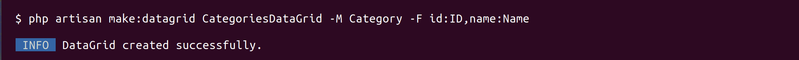

# LaravelDatagrid

[](https://packagist.org/packages/wdev-rs/laravel-datagrid)
[](https://github.com/wdev-rs/laravel-datagrid/actions/workflows/test.yml)
[](https://scrutinizer-ci.com/g/wdev-rs/laravel-datagrid)
[](https://packagist.org/packages/wdev-rs/laravel-datagrid)

This packages makes it easy to create data-grid for your Laravel application, for example admin panels, or any other 
searchable and sortable list. This package comes with 2 frontend options:
- [Grid.js](https://gridjs.io/)
- DataGrid's own Vue 3 frontend.

Both frontends offer server side functionalities like searching, sorting and pagination.


## Demo
Please find a demo application [here](https://laravel-datagrid.wdev.rs) and the source code of the demo application
[here](https://github.com/wdev-rs/laravel-datagrid-demo);

## Installation

You can install the package via composer:

```bash
composer require wdev-rs/laravel-datagrid
```

Optional - if you use Grid.js install the package with npm

```bash
npm install gridjs@^6.0.0 
```

Publish the vendor files by running the following command:

**Using Grid.js frontend**

```bash
php artisan vendor:publish --provider="WdevRs\LaravelDatagrid\LaravelDatagridServiceProvider" --tag="gridjs"
```
Register the DataGrid fronted Vue.js component by adding the following lines to your `app.js`:

```javascript
import DataGrid from "./vendor/laravel-datagrid/gridjs/Components/DataGrid.vue";

app.component('data-grid', DataGrid);
```

Use the component in your view file (or in another component):
```html
<data-grid
    base-url={{$baseUrl}}
    :columns="{{json_encode($columns)}}"
    :rows="{{json_encode($rows)}}"
></data-grid>
```


**Using Datagrid Vue 3 frontend**

```bash
php artisan vendor:publish --provider="WdevRs\LaravelDatagrid\LaravelDatagridServiceProvider" --tag="datagrid"
```

Register the DataGrid fronted Vue.js component by adding the following lines to your `app.js`:

```javascript
import DataGrid from "./vendor/laravel-datagrid/datagrid/Components/DataGrid.vue";

app.component('data-grid', DataGrid);
```

Use the component in your view file (or in another component):

```html
<data-grid
    :columns="{{json_encode($columns)}}"
    :rows="{{json_encode($rows)}}"
></data-grid>
```

## Usage

The base of this package is the `\WdevRs\LaravelDatagrid\DataGrid\DataGrid` class. This class is used to define the 
columns and the behavior of the datagrid. While you can use this class directly from the controller, I 
suggest extending it and create separate classes for each datagrid.

``` php
class CategoriesDataGrid extends DataGrid
{

    /**
     * CategoriesDataGrid constructor.
     */
    public function __construct()
    {
        $this->fromQuery(Category::query())
            ->column('id', 'ID', null, 50)
            ->column('name', 'Name', function ($category) {
                return view('admin.categories.actions.edit_link', ['category' => $category])->render();
            })
            ->key('id')
    }
}
```

Using the `fromQuery` method you can define what should be the base query for the DataGrid. It accepts a Laravel Query Builder object.
The `column` method is used to define the columns of the DataGrid, the argument are as follows:
- `id` - the name of the field in the database
- `name` - the label which should appear in the DataGrid column header
- `formatter` - optional, callable allows you to format the display of the column. As you can see from the above example
  probably the most elegant way to do this is to include a blade view and render it.
- `width` - optional, the with of the column
- `sortable` - optional, boolean if the column should be sortable, default true
- `searchable` - optional, boolean if the column should be searchable, default true

The `key` method defines the unique identifier for the rows, usually id. Specifying the
key is necessary for the mass actions to work when using datagrid frontend.

### Data sources
You can create data grid from different data sources:
- Eloquent queries - use the fromQuery() method
- Collections - use the fromCollection() method
- Arrays - use the fromArray() method

When the DataGrid definition is ready, you can add it to the controller:

```php
    public function index(CategoriesDataGrid $dataGrid, Request $request)
    {
        return $dataGrid->render();
    }
```

If the `render` method is called without arguments it will use the default view `resources/views/vendor/laravel-datagrid/datagrid.blade.php`, 
or you can pass your own view and use the DataGrid there:

```php
    public function index(CategoriesDataGrid $dataGrid, Request $request)
    {
        return $dataGrid->render('admin.common.index');
    }
```

If you use Inertia for frontend, you can configire laravel-datagrid to use
inertia for rendering instead of blade. First publish the config file:

```shell
php artisan vendor:publish --provider="WdevRs\LaravelDatagrid\LaravelDatagridServiceProvider" --tag="config"
```

Change the rendering method in the published `config/laravel-datagrid.php`:

```php
'render_with' => \WdevRs\LaravelDatagrid\LaravelDatagrid::RENDER_INERTIA
```

Now you can pass the name of the vue component to the `render` method, it 
is going to be rendered with Inertia.

## Available commands
###### Code related

- [**make**:datagrid](#make-datagrid) ~  Generates datagrid class
  ---
<a name="make-datagrid"/>

## `php artisan make:datagrid <-M|--model> <-F|--fields>`

Generates datagrid class, the generated class is placed in \App\DataGrids directory

- -M|--model name of the model to use
- -F|--fields the name of the fields of the comma separated: 'field1,field2,field3' or 'field1:label1,field2:label2,field3:label3'

Generated class 

```php
    class CategoriesDataGrid extends DataGrid
    {
    
        /**
         * CategoriesDataGrid constructor.
         */
        public function __construct()
        {
            $this->fromQuery(Category::query())
                ->column('id', 'ID', null, 50)
                ->column('name', 'Name')
        }
    }
```

#### Usage example



## Frontend customisations

### Using Grid.js

The frontend component of the DataGrid can be found in the `resources/js/vendor/laravel-datagrid/gridjs/Components/DataGrid.vue`
By default DataGrid comes with one row action, which is the delete action. This action can be found in the following file: 
`resources/js/vendor/laravel-datagrid/gridjs/actions/delete.js`

You can extend it with more custom actions by creating them based on the existing one. To add the to the datagrid,
extend the `cols` definition in the `DataGrid.vue`:
```javascript
            cols: this.columns.map((col) => {col.formatter = (cell) => html(cell); return col;}).concat(
                [{
                    name: 'Actions',
                    sort: false,
                    width: 50,
                    formatter: (cell, row) => {
                        return h('div', {className: "text-center"},
                            deleteAction.call(this, row.cells[0].data,row.cells[1].data),
                            yourCustomAction.call(this, row.cells[0].data,row.cells[1].data)
                        )
                    }
                }]
            )
```

### Using Datagrid Vue3

Datagrid's own vue 3 frontend offers extended functionality compared to 
grid.js, for example mass actions, filters and row action customisations.

#### Mass actions
Mass actions is a method to run specific action on multiple records. For example delete
multiple records at once.

When using mass actions I suggest using datagrid in a wrapper component. 
Mass actions can be defined using the `mass-actions` prop in an array 
`[{'action' : 'massDelete', 'label': 'Delete'}]`

Datagrid will fire an event when the user selects rows and runs an action on them.
The name of the event is what you defined in the `action` property, in this case `massDelete`.
Handle the event on the usual way, the handler gets the array of `selectedIds` as an argument:

```vue
@massDelete="(selectedIds) => alert('Simulating mass delete on id(s): ' + selectedIds.join(','))"
```

Please find the code of the complete component below.

```vue
<script setup>
    import DataGrid from './../vendor/laravel-datagrid/datagrid/Components/DataGrid.vue'

    const props = defineProps({
        columns: Array,
        rows: Object,
    });

    const alert = (text) => {
        window.alert(text);
    }
</script>

<template>
    <data-grid
        :columns="props.columns"
        :rows="props.rows"
        :mass-actions="[{'action' : 'massDelete', 'label': 'Delete'}]"
        @massDelete="(selectedIds) => alert('Simulating mass delete on id(s): ' + selectedIds.join(','))"
    ></data-grid>
</template>

```

## Upgrade from Laravel DataGrid 0.x

Update the vendor assets using --force option:

**Using Grid.js**
```php
php artisan vendor:publish --provider="WdevRs\LaravelDatagrid\LaravelDatagridServiceProvider" --tag="gridjs" --force
```

**Using datagrid frontend**
```php
php artisan vendor:publish --provider="WdevRs\LaravelDatagrid\LaravelDatagridServiceProvider" --tag="datagrid" --force
```

Update the import paths in the app.js to use correct DataGrid component (grid.js or datagrid), see the example above.

Update the usage of the data-grid component to pass the rows property:

```html
<data-grid
    base-url={{$baseUrl}}
    :columns="{{json_encode($columns)}}"
    :rows="{{json_encode($rows)}}"
></data-grid>
```

### Testing

``` bash
composer test
```

### Changelog

Please see [CHANGELOG](CHANGELOG.md) for more information what has changed recently.

## Contributing

Please see [CONTRIBUTING](CONTRIBUTING.md) for details.

### Security

If you discover any security related issues, please email daniel@wdev.rs instead of using the issue tracker.

## Credits

- [Daniel Werner](https://github.com/wdev-rs)
- [All Contributors](../../contributors)

## License

The MIT License (MIT). Please see [License File](LICENSE.md) for more information.

## Laravel Package Boilerplate

This package was generated using the [Laravel Package Boilerplate](https://laravelpackageboilerplate.com).
